## The stack

## Activity

## Telemetry

## Badges unlocked

## Reach me

- Mail — <ankitbhuyans@gmail.com>
- LinkedIn — [in/ankitorleaveit](https://www.linkedin.com/in/ankitorleaveit/)
- X — [@ankitorleaveit](https://twitter.com/ankitorleaveit)
- Google Developer profile — [g.dev/ankitorleaveit](https://g.dev/ankitorleaveit)

