<div align="center">



</div>

<div align="center">

<a href="mailto:ankitbhuyans@gmail.com"></a>
<a href="https://www.linkedin.com/in/ankkkuuu/"></a>
<a href="https://twitter.com/ankkkuuu"></a>
<a href="https://g.dev/anxhvr"></a>


</div>

```console
$ whoami
Ankit Bhuyan — a passionate tech geek from India. I code stuff.

$ cat ./fun-fact.txt
I think I am funny.
```

## Ask me about

<p>


</p>

## Telemetry

<div align="center">


</div>

## Badges unlocked

<div align="center">



</div>

## Reach me

- Mail — <ankitbhuyans@gmail.com>
- LinkedIn — [in/ankitorleaveit](https://www.linkedin.com/in/ankitorleaveit/)
- X — [@ankitorleaveit](https://twitter.com/ankitorleaveit)
- Google Developer profile — [g.dev/ankitorleaveit](https://g.dev/ankitorleaveit)

<div align="center">
<sub>scan terminated · connection closed · <code>ankitorleaveit</code></sub>
</div>
